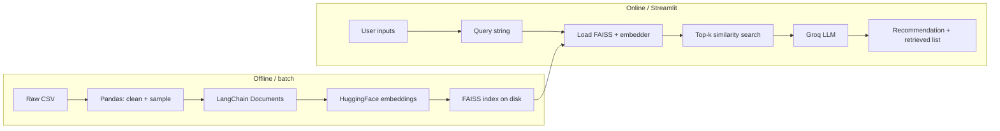

# Foodrec-AI — Technical Overview & Interview Preparation

This document explains **how the application is implemented** end-to-end and lists **questions an interviewer might ask**, with concise answer angles.

For **implementation-only** detail (every module, function, and control-flow step), see [IMPLEMENTATION_DETAILS.md](IMPLEMENTATION_DETAILS.md).

---

## 1. Elevator pitch (30 seconds)

**Foodrec-AI** is a restaurant recommendation app built on **RAG (Retrieval-Augmented Generation)**. User preferences from a Streamlit UI are turned into a natural-language query. A **FAISS vector store** finds the most semantically similar restaurants using **sentence-transformer embeddings**. A **Groq-hosted LLM** reads only those retrieved snippets and produces a short recommendation with rationale. The dataset is a cleaned, sampled Zomato-style CSV (Bangalore restaurants).

---

## 2. High-level architecture

**Key idea:** The LLM never sees the full database—only **k retrieved documents**—which grounds answers, reduces hallucination of fake venues, and keeps token cost bounded.

---

## 3. Implementation by layer

### 3.1 Data processing (`src/data_processing/`)

| Step | Module | What happens |
|------|--------|----------------|
| Load | `load_dataset.load_raw_dataset` | Read raw CSV (default path from `src.paths.raw_dataset_csv` / `constants.DEFAULT_RAW_CSV_NAME`) |
| Clean | `load_dataset.clean_dataset` | Header normalization; aliases in `column_aliases.py` → canonical columns; `dropna`; coerce cost/rate; pad full schema |
| Sample | `load_dataset.sample_rows` | Random sample (e.g. 2000 rows) for faster iteration |
| Save | `load_dataset.save_cleaned_dataset` | Write `data/processed/restaurants_clean.csv` |
| Orchestration | `load_dataset.run_pipeline` | Chains the above (used by `scripts/run_data_pipeline.py`) |

**Why sample?** Smaller corpus → faster embedding build, cheaper experiments, still representative for demos.

---

### 3.2 Document representation (`document_builder.py`)

Each row becomes a **LangChain `Document`**:

- **`page_content`**: Human-readable block (restaurant name, location, cuisine, cost, rating, type) — this is what gets embedded and shown to the LLM.
- **`metadata`**: Structured fields (name, location, etc.) for filtering or UI; extensible without changing the embedding text format.

**Why structured text?** Embedding models work on natural language; a consistent template improves retrieval consistency.

---

### 3.3 Embeddings (`src/embeddings/embedder.py`)

- **Model:** `sentence-transformers/all-MiniLM-L6-v2` via **`langchain_huggingface.HuggingFaceEmbeddings`**.
- **Vector size:** 384 dimensions (typical for this model).
- **Role:** Same model is used when **building** the FAISS index and when **querying** it, so query and document vectors live in the same space.

**Why MiniLM?** Good speed/quality tradeoff for CPU; widely used; no paid API for embeddings.

---

### 3.4 Vector store (`src/retrieval/vector_store.py`)

- **Library:** **FAISS** via `langchain_community.vectorstores.FAISS`.
- **Persist:** `save_local` / `load_local` under `data/vector_store/` (with `allow_dangerous_deserialization=True` on load because of pickle — only load indexes you trust).
- **Creation:** `scripts/build_vector_store.py` loads cleaned CSV → builds documents → embeds → saves index.

**Why FAISS?** Fast approximate nearest neighbors in memory; simple local deployment; pairs naturally with LangChain.

---

### 3.5 Retrieval & pipeline (`src/retrieval/`, `src/pipeline/`)

- **`search_restaurants`** (`retriever.py`): Runs `similarity_search_with_score(query, k)` on a loaded FAISS store and returns `RetrievalHit` objects (document + score). All retrieval should go through this so scores and debug logging stay consistent.
- **`retrieve_restaurants`**: Same as above but loads embedder + FAISS from disk each call — useful for one-off scripts.
- **Debug logging:** Set environment variable `FOODREC_RETRIEVAL_DEBUG=1` to print each query, score, and restaurant name to **stderr** (terminal), including from Streamlit’s backend process.
- **`recommend_restaurant`** (`recommendation_pipeline.py`):  
  1. `search_restaurants(vector_store, query, k)`  
  2. `generate_recommendation(query, retrieved_docs)`  
  3. Returns a ``RecommendationResult`` ``TypedDict``: `recommendation`, `retrieved_docs`, `retrieval_hits`, `retrieval_scores`.

This is the **minimal RAG orchestration** the Streamlit app calls.

---

### 3.6 LLM layer (`src/llm/recommender.py`)

- **Provider:** **Groq** (`langchain_groq.ChatGroq`).
- **Model:** `llama-3.1-8b-instant` (current production-friendly Groq model).
- **Prompt:** System-style instructions + user request + concatenated `page_content` of retrieved docs.
- **Config:** `temperature=0` for more deterministic recommendations.
- **Secrets:** `GROQ_API_KEY` in `.env`; loaded from project root with `python-dotenv`.

**Why Groq?** Fast inference, generous free tier, OpenAI-compatible style APIs; avoids hosting a large model yourself.

---

### 3.7 Frontend (`app/streamlit_app.py`, `app/ui.py`, `app/query_builder.py`)

- **Entry:** `streamlit_app.py` — page config, `@st.cache_resource` for embedder + FAISS (loads once per session), fingerprint-based cache bust when the index on disk changes.
- **UI:** `ui.py` — global CSS, hero strip, index manifest caption, preference card, search results expanders.
- **Query:** `query_builder.py` — pure function turning form fields into the comma-separated natural-language string passed to retrieval + LLM.
- **Session:** Results stored in `st.session_state` until the user runs a new search.

---

## 4. End-to-end request flow (interview walkthrough)

1. User fills form → app builds **one natural-language query** (e.g. “looking for burger, budget around 800 INR for two, …”).
2. **Cached** embedding model + FAISS are already in memory.
3. **Pipeline** embeds the query and FAISS returns **top-k** similar `Document`s by cosine similarity (inner product / L2 depending on FAISS config in LangChain).
4. **LLM** receives query + joined `page_content` of those k docs.
5. **Response** is shown in the UI; expanders show each retrieved option verbatim.

---

## 5. Tradeoffs & limitations (honest talking points)

| Topic | Limitation | Mitigation / future work |
|--------|------------|---------------------------|
| **Coverage** | Only restaurants in the cleaned/sampled CSV | Increase sample size or use full data |
| **Grounding** | LLM can still overstate if prompt is weak | Stricter prompt, cite-only mode, or JSON schema output |
| **Geography** | “Location” is text in data, not lat/lon in core pipeline | Geocode + filter by radius; hybrid search |
| **Cold start** | No user history or collaborative filtering | Add session memory or user profiles |
| **Evaluation** | Mostly qualitative | Add offline metrics (nDCG@k), human eval rubric |
| **Security** | Pickle-loaded FAISS | Trust only self-built indexes; consider non-pickle stores for production |

---

## 6. Tech stack (quick reference)

| Layer | Technology |
|-------|------------|
| Language | Python 3.10+ |
| Data | Pandas |
| Orchestration / RAG | LangChain (`langchain-core`, `langchain-community`, `langchain-huggingface`, `langchain-groq`) |
| Embeddings | sentence-transformers / HuggingFace |
| Vector DB | FAISS (local) |
| LLM | Groq API |
| UI | Streamlit |
| Config | python-dotenv |

---

## 7. Potential interview questions & answer angles

### Architecture & design

**Q: Why RAG instead of fine-tuning a model on your CSV?**  
**A:** RAG keeps the **source of truth** in the database/index; updates are a data/embedding refresh, not a new training run. Fine-tuning is heavier, needs ML ops, and still risks hallucinations unless retrieval or constraints are added.

**Q: Why FAISS and not Pinecone/Weaviate/pgvector?**  
**A:** FAISS is **simple, local, and free**—good for a portfolio and demos. Managed vector DBs add latency, cost, and DevOps; I’d switch if we needed multi-tenant scale, HA, or metadata-heavy filters at scale.

**Q: What is “grounding” here?**  
**A:** The model’s answer is **conditioned on retrieved documents** only. It should pick among real rows, not invent restaurants—though I’d still validate outputs for production.

**Q: How do you prevent the model from recommending something not in the list?**  
**A:** Prompting (“choose from the options below”) + **short context** (only k docs). Stronger approaches: constrained decoding, JSON output with name from a closed set, or reranker that drops out-of-list names.

### Retrieval & embeddings

**Q: How does similarity search work?**  
**A:** Query text is embedded to a vector; FAISS finds **nearest neighbors** in embedding space. “Similar” means semantically close in the model’s representation, not necessarily keyword match.

**Q: Why k=5?**  
**A:** Balance between **context size** (tokens/cost/latency) and **recall** (chance the best place is in the set). Tuning k is a common lever; you can increase k and compress context or use a reranker.

**Q: What if the best restaurant is ranked 20th by embedding?**  
**A:** Then pure top-k retrieval misses it. Mitigations: **larger k**, **reranking** (cross-encoder on query–doc pairs), **hybrid search** (BM25 + dense), or **MMR** for diversity.

### LLM & product

**Q: Why Groq?**  
**A:** Fast and cost-effective for demos; API similar to other chat providers. Model choice (`llama-3.1-8b-instant`) is a balance of quality and latency.

**Q: Why temperature 0?**  
**A:** More **repeatable** recommendations for the same query+context—useful for debugging and demos. Slightly higher temperature could diversify wording.

**Q: How would you add user feedback (“thumbs down”)?**  
**A:** Log (query, retrieved ids, rating); use for **analytics**, **prompt tuning**, or future **learning-to-rank** / bandit reranking—not necessarily immediate fine-tuning of the LLM.

### Engineering & deployment

**Q: How do you avoid reloading the model on every Streamlit interaction?**  
**A:** `@st.cache_resource` on expensive singletons (embedder + FAISS). Streamlit reruns the script often; caching keeps latency acceptable.

**Q: How would you deploy this?**  
**A:** Container (Docker) with Streamlit or FastAPI + separate UI; secrets via env; build FAISS in CI or ship prebuilt index; consider health checks and rate limits on the LLM API.

**Q: What about `requirements.txt` encoding on Windows?**  
**A:** Save as **UTF-8** (not UTF-16); some hosts (e.g. Streamlit Cloud) choke on wrong encodings. Pin or use ranges consciously for reproducibility vs. install speed.

### Behavioral / situational

**Q: What was the hardest part?**  
**A:** (Tailor to your experience.) Examples: **tuning retrieval** so queries like “cheap biryani” hit good docs; **balancing** UI fields vs. one embedding-friendly query string; **deployment** quirks (deps, secrets).

**Q: How would you test this?**  
**A:** Unit tests for cleaning and query building; smoke tests for pipeline scripts; **golden-set** of queries with expected restaurants in top-k; optional LLM eval with rubric.

**Q: What would you do next with 2 more weeks?**  
**A:** Metrics (recall@k), reranker, better eval harness, auth, logging, hybrid search, or explicit **filters** (price band) pre- or post-retrieval.

---

## 8. Files to mention in a live code walk

| Path | Talking point |
|------|----------------|
| `app/streamlit_app.py` | Thin entry: caching, session state, calls `ui` + `query_builder` |
| `app/ui.py` / `app/query_builder.py` | Presentation vs pure query string logic |
| `src/pipeline/recommendation_pipeline.py` | Thin orchestration: retrieve → generate; `RecommendationResult` |
| `src/retrieval/vector_store.py` | FAISS lifecycle, manifest, fingerprint |
| `src/llm/recommender.py` | Prompt + Groq chain |
| `src/data_processing/column_aliases.py` / `load_dataset.py` | Header mapping vs ETL |
| `src/paths.py` / `scripts/bootstrap.py` | Single path resolution; CLI import path |
| `scripts/run_data_pipeline.py` / `build_vector_store.py` | How the index is produced |

---

## 9. One-minute “deep dive” closing

> “I built a RAG pipeline over a restaurant dataset: Pandas cleans and samples the data, LangChain turns rows into documents, MiniLM embeddings go into a local FAISS index, and at query time I retrieve the top semantic matches and pass them to a Groq LLM with a constrained prompt. Streamlit caches the heavy models, composes the user intent into one query string, and shows both the LLM summary and the retrieved evidence. Tradeoffs are fixed k, no collaborative filtering yet, and grounding that depends on retrieval quality—next steps would be evaluation metrics and optional reranking or hybrid search.”

---

*Keep this file next to your README when sharing the repo with interviewers.*
